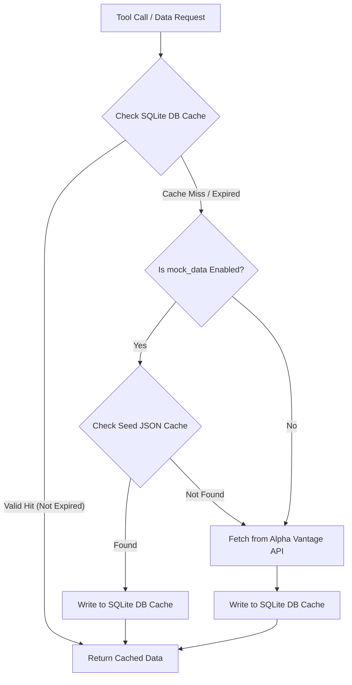

# Fink: A WYSIWYG Personal Finance Due Diligence Tool

Fink is a web-based tool for financial due diligence. It allows users to plot historical stock prices and various financial metrics for a given stock ticker, using data from the Alpha Vantage API.

## Features

*   **Interactive Charts:** Visualize financial data using Chart.js, with support for dual Y-axes.
*   **Multiple Metrics:** Plot key financial indicators such as:
    *   Adjusted Close Price
    *   PE (Price-to-Earnings) Ratio
    *   PS (Price-to-Sales) Ratio
    *   Shares Outstanding
    *   TTM (Trailing Twelve Months) Dividends
*   **Customizable Timeframe:** View data for the last 1, 5, 10, or 20 years, or all available historical data.
*   **Human-Readable Formatting:** Axes and tooltips display large numbers and currency in an easy-to-read format (e.g., "1.2B" for billions, "$2.50" for currency).
*   **API Caching:** Implements a client-side LRU cache to minimize API calls to Alpha Vantage and improve performance on repeated requests.
*   **Execution Log:** A "papertrail" log shows the steps the application is taking to fetch and process data, making it easier to debug.

## How to Use

1.  Open `index.html` in a modern web browser.
2.  Enter a valid stock ticker symbol (e.g., `IBM`, `AAPL`).
3.  Enter your personal [Alpha Vantage API Key](https://www.alphavantage.co/support/#api-key).
4.  Select the desired timeframe from the dropdown menu.
5.  Use the checkboxes and radio buttons to select which metrics to plot on the chart.
6.  Click the "Plot Data" button. The chart will update dynamically.

## Running Locally

Because modern browsers have security restrictions that prevent loading JavaScript modules directly from the local filesystem (`file://`), you need to run a simple local web server to use this application.

1.  **Install `http-server`:** If you don't have it, install it globally via npm:
    ```bash
    npm install -g http-server
    ```
2.  **Start the server:** Navigate to the project's root directory (`/Users/ajitapte/fink`) in your terminal and run the following command:
    ```bash
    http-server -p 8081 .
    ```
3.  **Access the application:** Open your web browser and go to `http://localhost:8081`.

## Project Structure

The project is organized into three main files:

*   `index.html`: The main HTML file containing the structure of the web application.
*   `styles.css`: Contains all the custom CSS and styling for the application.
*   `script.js`: The core JavaScript file that handles:
    *   User input and UI interactions.
    *   Fetching and caching data from the Alpha Vantage API.
    *   Processing and transforming raw financial data into plottable metrics.
    *   Rendering and updating the chart with Chart.js.

## Tech Stack

*   HTML5
*   CSS3 with [Tailwind CSS](https://tailwindcss.com/)
*   Vanilla JavaScript (ES6+)
*   [Chart.js](https://www.chartjs.org/) for charting
*   [Alpha Vantage API](https://www.alphavantage.co/) for financial data

---

## Where things live

| Directory | What it is | Status |
|---|---|---|
| [`mcp_apps/`](mcp_apps/README.md) | **MCP Apps server for Claude Desktop.** Conversational due diligence: an anomaly scan rendered as an interactive panel, with charts of the evidence behind each finding. | active |
| `mcp/` | MCP server for Open WebUI, using the rich-embed convention. | legacy — see [`mcp_apps/data/README.md`](mcp_apps/data/README.md) for the migration policy |
| `open_webui/` | Earlier Open WebUI integration. | superseded by `mcp/` |
| `index.html` | The original browser-only charting tool this README describes below. | standalone |

**Start with [`mcp_apps/README.md`](mcp_apps/README.md)** — setup, the tool
API, and how to test it in Claude Desktop.

---

## Backend Architecture & MCP Server

> **Note:** this section describes `mcp/`, the Open WebUI server. The data
> layer was forked to `mcp_apps/data` on 2026-08-03 and has since diverged —
> see [`mcp_apps/data/README.md`](mcp_apps/data/README.md).

Fink implements a Model Context Protocol (MCP) server that exposes optimized tools for stock financial research and visualization to LLM agents (such as Open WebUI).

### 1. Offline-First Read-Through Cache Flow

To minimize network calls and API rate limits, the data retriever implements a read-through database caching layer:



---

### 2. Data Schemas & Formats

#### A. Raw Alpha Vantage Response
This is the standard response structure returned by the live Alpha Vantage endpoints for financial statements (`INCOME_STATEMENT`, `BALANCE_SHEET`, `CASH_FLOW`):
```json
{
  "symbol": "UNH",
  "annualReports": [
    {
      "fiscalDateEnding": "2023-12-31",
      "reportedCurrency": "USD",
      "totalRevenue": "371532000000",
      "netIncome": "22381000000",
      ...
    }
  ],
  "quarterlyReports": [ ... ]
}
```

#### B. Seed Cache (`mcp/data/local_av_cache/{ticker}.json`)
A static, unified pre-seeded JSON file containing full response payloads mapped by function names to allow complete local testing without hitting API rate limits:
```json
{
  "OVERVIEW": { "Symbol": "UNH", "AssetType": "Common Stock", ... },
  "INCOME_STATEMENT": { "symbol": "UNH", "annualReports": [...] },
  "BALANCE_SHEET": { "symbol": "UNH", "annualReports": [...] },
  "CASH_FLOW": { "symbol": "UNH", "annualReports": [...] },
  "TIME_SERIES_MONTHLY_ADJUSTED": {
    "Meta Data": { ... },
    "Monthly Adjusted Time Series": { ... }
  }
}
```

#### C. SQLite Cache Database (`mcp/data/cache.db`)
Stores individual function payloads along with tracking metadata under the `av_cache` table:
* **Table Schema**:
  ```sql
  CREATE TABLE IF NOT EXISTS av_cache (
      symbol TEXT,
      function TEXT,
      data TEXT,         -- Raw JSON string matching Alpha Vantage format
      timestamp REAL,    -- Time loaded (Epoch seconds)
      expires_at REAL,   -- TTL Expiration Time (Epoch seconds)
      source TEXT,       -- 'mock' (local seed file) or 'api' (Alpha Vantage network)
      PRIMARY KEY (symbol, function)
  );
  ```

#### D. Aligned Chart Output (`get_aligned_historical_data`)
The Python processor aligns the raw monthly price series with interpolated quarterly fundamentals and returns a chronological list of `ChartDataPoint` objects smoothed via a 3-month Simple Moving Average (SMA). 

Each data point follows this Python NamedTuple structure:
```python
class ChartDataPoint(NamedTuple):
    date: str                  # Chronological date label: "YYYY-MM-DD"
    price: float               # Split-adjusted closing stock price
    revenue: Optional[float]   # Smoothed annual-aligned total revenue
    operating_income: Optional[float]
    net_income: Optional[float]
    free_cash_flow: Optional[float]      # calculated: operating_cash_flow - capex
    roic: Optional[float]                # Return on Invested Capital (%)
    eps: Optional[float]                 # Earnings Per Share
    capex: Optional[float]               # Capital expenditures
    operating_cash_flow: Optional[float]
    pe_ratio: Optional[float]            # Valuation: Price / EPS
    ps_ratio: Optional[float]            # Valuation: Price / (Revenue / Shares)
    pfcf_ratio: Optional[float]           # Valuation: Price / (FCF / Shares)
    pocf_ratio: Optional[float]           # Valuation: Price / (OCF / Shares)
    shares_outstanding: Optional[float]
    dividends: float                     # Dividend payment size
    dividend_yield: Optional[float]      # Dividend yield (%)
    payout_ratio_fcf: Optional[float]    # Dividend / Free Cash Flow (%)
    payout_ratio_ocf: Optional[float]    # Dividend / Operating Cash Flow (%)
```
This list is formatted into a lightweight JSON array under 5KB and passed directly to the browser visualization iframe, preventing any large payload bottlenecks.
 