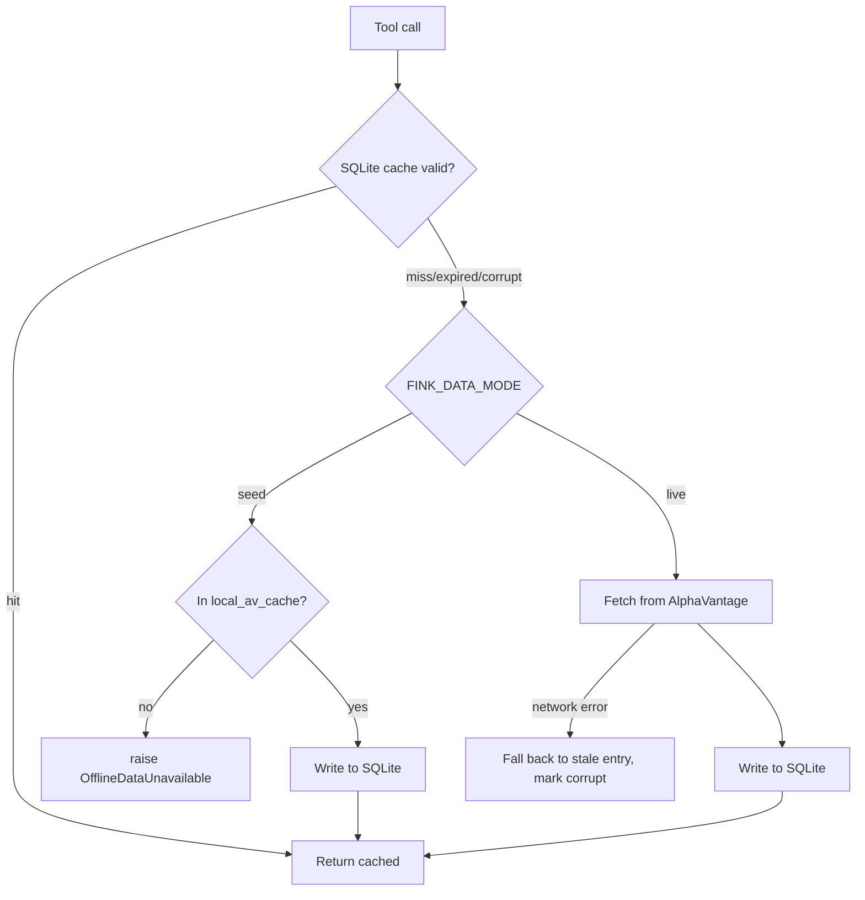

# Fink MCP Tools Server

Exposes financial data retrieval, metric computation, and interactive chart
visualization as Model Context Protocol tools, consumed by an Open WebUI agent.

---

## 1. Supported Workflows

1. **Stock financials** — *"Show me financials for UNH for the last 5 years."* The model
   renders an interactive chart; if no metrics are named it gets a sensible default set.
2. **Conversation-driven adjustment** — *"plot EPS instead"*, *"just the last 2 years"*,
   *"normalize that"*. The model re-invokes the tool with new parameters.
3. **Direct widget interaction** — metric checkboxes, per-share toggles, left/right axis
   selectors, a dual-thumb year slider, and Normalize / Growth Rate buttons all operate
   client-side without a server round trip.
4. **Quantitative analysis** — *"Why did AMZN's margins move in 2022?"* The model pulls
   structured JSON and reasons over it, usually with a supporting chart.

---

## 2. Tools

Two tools, both auto-fetching on cache miss. Full schemas in [API_GUIDE.md](./API_GUIDE.md).

| Tool | Purpose | Returns |
|---|---|---|
| `visualize_html` | Interactive Chart.js dashboard | `<iframe srcdoc="...">` |
| `compute_metrics` | Aligned historical metrics for reasoning | JSON string |

Open WebUI calls them through two *native tool* wrappers, `visualize_native` and
`compute_metrics_native`, which POST to the MCP server over HTTP (the server is wrapped
by `mcpo` into an OpenAPI endpoint on port 8001).

**Token efficiency.** `visualize_html` never returns the dataset. It writes a
per-ticker `{ticker}-data.json` to the static directory and emits an iframe that fetches
it in the browser, keeping years of monthly series out of the model's context.
`compute_metrics` returns only the requested metrics and omits absent values.

---

## 3. UI Design Alternatives

Approaches tried for rendering interactive widgets inside Open WebUI:

| Approach | Outcome |
| :--- | :--- |
| **Raw HTML in markdown** | **Failed.** Markdown sanitisation stripped `<script>` blocks, and serializing years of data inline blew the single-turn output token limit, truncating the payload. |
| **Sandboxed iframe** | **Failed.** Relative paths to `dashboard.css`, `chart.js` and `chartUtils.js` could not resolve. |
| **Native tool + `embeds` event (current)** | **Works.** A Svelte-registered native tool emits an `embeds` event carrying the HTML; assets resolve against the page origin, and animated transitions work on checkbox and slider changes. |

> An earlier revision of this document described in-place updating of an existing chart
> via `window.parent` DOM inspection. **That was never implemented** — no such code
> exists in any commit. Re-invoking the tool renders a new widget. Tracked in
> [TECH_DEBT.md](./TECH_DEBT.md).

---

## 4. Directory Structure

```
mcp/
├── server.py                  FastMCP entry point; registers the two tools
├── metrics_registry.py        Single source of truth for all 33 metrics
├── system_prompt.py           Agent system prompt (shared by seeding and tests)
├── requirements.txt
├── data/                      Retrieval and computation — see data/README.md
│   ├── cache_orchestrator.py    cache_ticker_data(), per-ticker mutex
│   ├── fetch_utils.py           SQLite cache I/O, AlphaVantage calls, FINK_DATA_MODE
│   ├── alphavantage_tool.py     Fetch orchestration + error shaping
│   ├── process_utils.py         Alignment, TTM, smoothing, corporate identity
│   ├── models.py                Pydantic ChartDataPoint
│   └── local_av_cache/          Seed corpus: AAPL, AMZN, NEE, PG, UNH
├── visualization/
│   ├── visualization_tool.py    Builds the dashboard HTML
│   ├── chartUtils.js            Canonical chart logic (copied to open_webui/static/)
│   ├── dashboard.css
│   └── fink_*_native_tool.py    Open WebUI native tool wrappers
├── setup/                     Deployment — see setup/README.md
├── tests/                     64 tests — see §6
└── docs/
    └── REVENUE_SEGMENTS_RESTORATION.md
```

---

## 5. Data Modes

`FINK_DATA_MODE` controls where financial data may come from:

| Mode | Resolution order | Set by |
|---|---|---|
| `live` (default) | SQLite cache → AlphaVantage API | `docker-compose.yml` |
| `seed` | SQLite cache → `local_av_cache/` JSON → **raise** | `tests/conftest.py` |

Seed mode never touches the network, so the suite is deterministic, consumes no API
quota, and cannot pollute the shared cache. `mock_data=True` alone was insufficient —
it only *prefers* the seed corpus and falls through to the network on a miss.

### Read-through cache



TTLs are derived per function from the gap between reported periods, so annual
statements are not refetched daily.

---

## 6. Test Coverage

64 tests. Invocations are in [setup/README.md](./setup/README.md#verification).

| Tier | Files | Needs |
|---|---|---|
| Unit / integration | `test_alphavantage_tool`, `test_cache_flow`, `test_cache_orchestrator`, `test_edge_cases`, `test_visualization_tool`, `test_mcp_server` | nothing — fully offline |
| Widget (Playwright) | `test_e2e_widget` | chromium |
| Server-dependent | `test_e2e_tool_dispatch`, `test_e2e_llm_tool_loop`, `test_docker_e2e` | running containers, `OPENAI_API_KEY` |

Notable coverage:

- **Transform behavior** — Normalize and Growth Rate are asserted against real Chart.js
  dataset *values*, not against strings in the HTML. The previous string-match tests
  stayed green while the feature was entirely non-functional.
- **Timeframe resolution** — `test_e2e_llm_tool_loop` builds the *production* system
  prompt (rendering `{{CURRENT_DATE}}` as Open WebUI does) and asserts the resolved
  year window, so prompt regressions are caught.
- **Offline guarantee** — `test_seed_mode_never_reaches_the_network`.
- `tests/conftest.py` puts `mcp/` on `sys.path` and forces seed mode, so a bare
  `pytest mcp/tests/` behaves identically to the wrapper script.

---

## 7. Installation

See **[setup/README.md](./setup/README.md)**. From the repository root:

```bash
./mcp/setup/setup.sh
```
