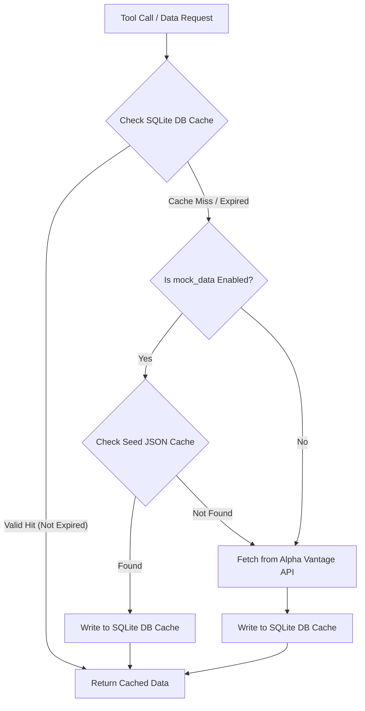

# Fink MCP Tools Server

The Fink MCP tools server exposes financial data gathering, processing, and interactive chart visualization capabilities as Model Context Protocol (MCP) tools.

---

## 1. Supported User Workflows & Use Cases

1. **Asking for Stock Financials**: Users can ask for a stock's historical performance (e.g., *"Show me financials for UNH for the last 5 years"*). The LLM will trigger the fetch tools and mount the visualizer.
2. **Conversation-Driven Chart Adjustments**: Users can refine the active chart directly through chat follow-ups without repeating the ticker (e.g., *"plot EPS instead"*, *"how about just the last 2 years?"*). The LLM resolves the context and triggers an in-place chart repaint.
3. **Widget Controls Interaction**: Users can interact directly with the chart iframe using the timeline range sliders and metric checkboxes. The chart updates dynamically inside the web interface.

---

## 2. Token-Efficient Data & Tool Architecture

To prevent large financial statements from bloating the LLM's context window (saving tokens and protecting context limits), the tools coordinate efficiently:

1. **`fink_openapi_mcp_tool_alphavantage_post`**:
   * **Purpose**: Fetches financial statements (Income Statement, Balance Sheet, Cash Flow, monthly adjusted prices) for a given ticker from Alpha Vantage and writes it directly to the local SQLite DB cache inside the container.
   * **API**: `ticker: str` -> returns a status confirmation message, **not** the raw dataset. The LLM only receives confirmation that data is cached, keeping the context clean.
2. **`visualization_embed_native`**:
   * **Purpose**: Generates and mounts an interactive Chart.js financial analytics chart for the Svelte interface.
   * **API**: `ticker: str, selected_metrics: list, start_year: int, end_year: int` -> returns an emitter event payload mounting the Svelte widget frame.
   * **In-Place Updates**: If a chart is already active in the chat DOM, this tool triggers a client-side window message to update the parameters of the active frame in-place, rather than appending duplicate charts.

---

## 3. UI Design Alternatives Analysis

During development, multiple approaches to rendering the interactive HTML widgets inside Open WebUI were explored:

| Design Alternative | How It Works | Why It Failed |
| :--- | :--- | :--- |
| **Raw HTML Markdown Injection** | The LLM returned raw HTML and `<script>` blocks embedded directly inside markdown code fences. | **Failed**: Markdown parsers and browser sanitation engines escaped the HTML tags and stripped `<script>` blocks for security, preventing the chart from executing. Additionally, serializing years of daily closing prices and financial statements into raw HTML inflated output payloads beyond the LLM's single-turn token output context size limits, resulting in truncated responses and broken tags. |
| **Sandboxed Iframe mounting** | Loaded the generated HTML payload directly into standard container iframes. | **Failed**: Local relative stylesheet (`dashboard.css`) and Javascript libraries (`chart.js`, `chartUtils.js`) could not resolve, throwing network path errors. |
| **Unified Svelte Native Embed & In-Place Updates (Winner)** | Registered a custom Svelte tool in Open WebUI that executes within the page origin. The tool mounts the iframe and intercepts loading. It uses client-side DOM checking (`window.parent`) to find and update any existing chart in-place. | **Success**: Safely loads all local JS/CSS files, supports animated transitions on checkbox/slider changes, and avoids chat feed duplicate clutter. |

---

## 4. Directory Structure

- `server.py`: Server entry point hosting tool registrations.
- `requirements.txt`: Python package requirements.
- `setup/`: Orchestration and deployment framework containing installer scripts, environment managers, and container provisioners (see [setup/README.md](file:///Users/ajitapte/.gemini/antigravity/scratch/fink/mcp/setup/README.md)).
- `data/`: Financial data retrieval domain.
  - `fetch_utils.py`: Fetches statements from Alpha Vantage API with SQLite cache fallback.
  - `process_utils.py`: Computes financial statement analysis metrics.
  - `models.py`: Data schemas.
  - `alphavantage_cache.db`: Shared caching database.
  - `alphavantage_tool.py`: Defines the `alphavantage` tool.
- `visualization/`: Visual rendering domain.
  - `chartUtils.js`: Client-side JavaScript Chart.js customization.
  - `visualization_tool.py`: Generates the HTML widget layouts.
- `tests/`: Automated unit, integration, and E2E browser tests.

---

## 5. Automated Test Coverage

The test suite resides in the `tests/` directory and covers the complete lifecycle of data operations and visual rendering:

1. **MCP Server Registrations (`test_mcp_server.py`)**:
   * Asserts FastMCP stdio server initialization, tool registration counts, and argument OpenAPI schema specs.
2. **Data Pipeline Cache Flow (`test_cache_flow.py`, `test_alphavantage_tool.py`)**:
   * Verifies the read-through database caching logic, checking write-offs, seed mock fallback lookups, and API key configurations.
3. **Dynamic HTML Adapters (`test_visualization_tool.py`)**:
   * Asserts that raw HTML generators correctly transform data coordinates, inject JSON parameter sets, and remove obsolete buttons.
4. **Browser Widget Rendering (`test_e2e_widget.py`)**:
   * Uses **Playwright** to spin up a headless Chromium instance, load the visualizer HTML page, serve mock JS/CSS libraries, and assert that the Chart.js canvas elements render and toggle metrics dynamically.
5. **Container E2E LLM Tool Selection (`test_docker_e2e.py`)**:
   * Verifies that the container's OpenAI endpoints successfully resolve tool schemas, invoke caching pipelines, and select custom visualizers strictly.

---

## 6. Installation & Setup

For installation guides, host prerequisite setups, and container configuration instructions, please refer to the unified setup guide:

👉 **[Go to setup/README.md](file:///Users/ajitapte/.gemini/antigravity/scratch/fink/mcp/setup/README.md)**

---

## 7. Caching & Data Formats

### Read-Through Cache Flow

