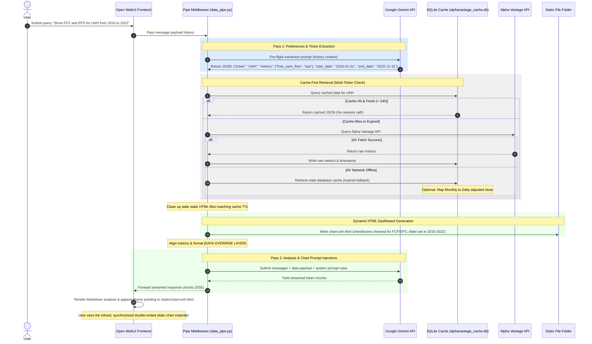

# Open WebUI Dynamic Financial Analytics Pipe (Gemini + Alpha Vantage Cache-First Modular Integration)

This project integrates Open WebUI with the Google Gemini API (v1beta/openai) and Alpha Vantage utilizing an Open WebUI native Pipe Function middleware. The stack is fully containerized, self-contained, and secure.

---

## 1. System Architecture

The following diagram illustrates how chat messages, preference extraction, data retrieval, local database caching, static assets compilation, and frontend rendering coordinate:



---

## 2. Technology Stack & Interactions

### Docker Containerization
*   **Orchestration**: Managed via `docker-compose.yml` to bring up the official Open WebUI container.
*   **Port Mapping**: `3000:8080` exposes the SvelteKit frontend server on the host port `3000`.
*   **PYTHONPATH Isolation**: `/app/backend/open_webui_analyst` mounts the custom modules (`alphavantage/`, `models.py`) safely without name conflicts, adding it to Python's system path so imports resolve cleanly.
*   **Offline Mode**: Setting `OFFLINE_MODE=True` disables default Hugging Face sentence-transformers model auto-updates on container startup, making boot times instantaneous.

### Open WebUI Pipe Function
*   **Pipe Class (`Pipe`)**: Implements Open WebUI's native ASGI `pipe` interface.
*   **Valves**: Exposes model configurations (API keys and default model) in the admin UI panel for easy management.
*   **Dynamic State Interceptor**: Scans every message. If no stock ticker is detected by the pre-flight prompt, it triggers the **Dormant State** and passes messages directly to Gemini. If a ticker is detected, it triggers the **Active State** to retrieve, cache, and inject metrics.

### Alpha Vantage Cache-First Engine
*   **SQLite Caching (`fetch_utils.py`)**: Stores responses locally in `alphavantage_cache.db` with a 24-hour Time-to-Live (TTL) invalidation policy to respect API rate limits.
*   **Offline Mapping Fallback**: If network fetches fail, it searches local pre-seeded JSON cache files. If daily price history is missing but monthly data is available, it maps monthly values into a simulated daily-close format, ensuring the UI chart renders correctly.

### Dynamic Checkboxes & Custom Double-Ended Range Slider
*   **Dynamic Checklist Controls**: Toggle metrics (Stock Price, P/E Ratio, EPS, Revenue, Free Cash Flow, Shares Outstanding) instantly.
*   **Modular Styles & Logic (`chartUtils.js`)**:
    *   `injectSliderStyles()`: Dynamically inserts the dual-range slider CSS track and handle styles into the document head at load time, keeping the HTML template code clean.
    *   `setupDualSlider(...)`: Overlays two standard range inputs, draws a dynamic `linear-gradient` highlight connection track between the thumbs, handles dragging events, and prevents start/end thumb crossover.
*   **Automatic Bounds Initialization**: Sorted date labels are constructed from the dataset on load, ensuring range boundaries (`min`/`max` values) are bound to the full timeline length immediately.
*   **Quick Timeline Snapping**: Buttons (`1Y`, `3Y`, `5Y`, `10Y`, `All`) programmatically move the handles and highlight the selected window.

---

## 3. Core Benefits

### Bring Your Own Model (BYOM)
*   The middleware utilizes standard OpenAI client specifications, allowing you to route requests to **any provider** (Google Gemini, OpenAI, Anthropic, or local offline LLMs running via Ollama/LM Studio).
*   Models and endpoints can be swapped dynamically on the fly by changing the Valves configuration in the admin dashboard.

### Local Privacy & Re-use
*   **Multi-Ticker SQLite Re-use**: Switching between tickers (or returning to a previously queried stock) reads directly from the cache, rendering the dashboard in `< 10ms` without making duplicate network requests.
*   **Automatic Storage Alignment**: Stale static HTML files are cleaned up from the static assets directory whenever their corresponding cache entry expires or gets removed, aligning local disk usage with database caching.
*   **Telemetry Bypass**: Setting `OFFLINE_MODE` blocks tracking connections and automatic model checks to Hugging Face, keeping operations completely private.

---

## 4. REST API Integration

Open WebUI exposes standard OpenAI-compatible endpoints on port 3000. You can query the custom model programmatically from any script or application:

1.  Navigate to **Settings > Account** and generate an **API Key**.
2.  Send a POST request requesting the model `data_pipe`:

```bash
curl -X POST http://localhost:3000/api/chat/completions \
  -H "Authorization: Bearer <your_api_key>" \
  -H "Content-Type: application/json" \
  -d '{
    "model": "data_pipe",
    "messages": [{"role": "user", "content": "Analyze UnitedHealth"}],
    "stream": true
  }'
```
